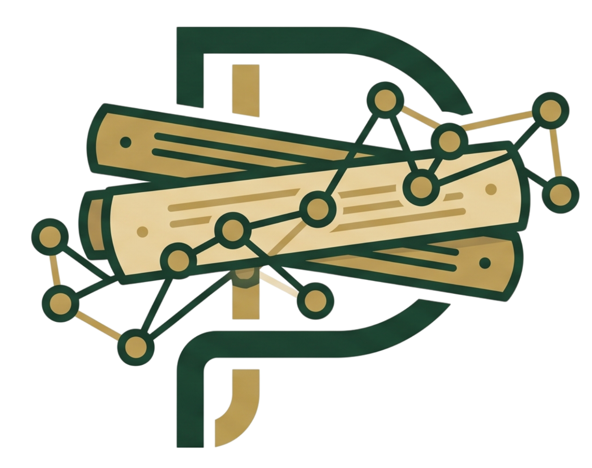
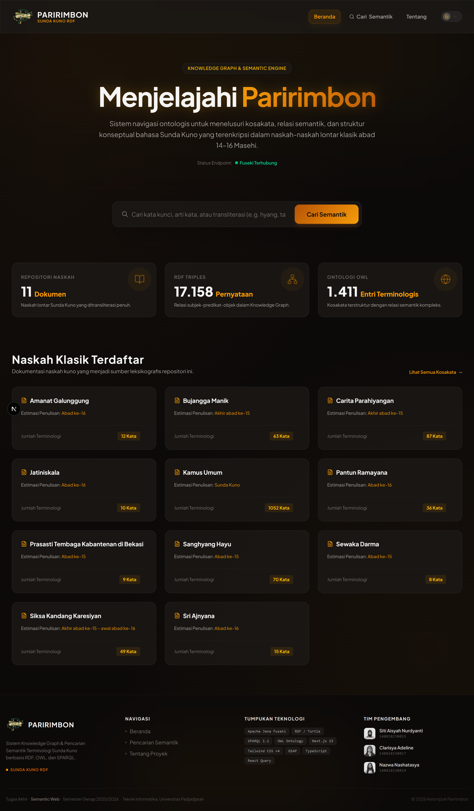
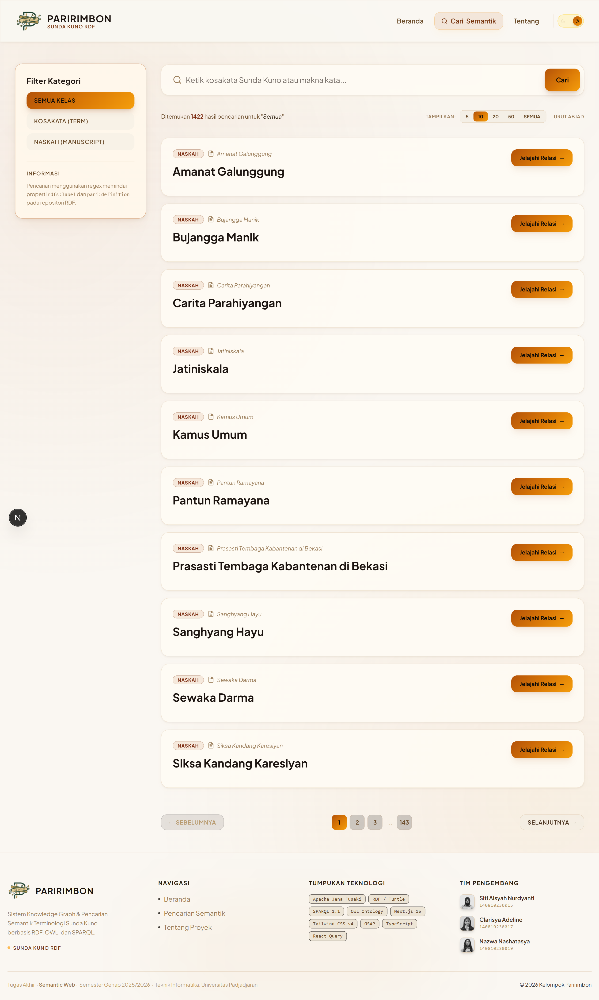
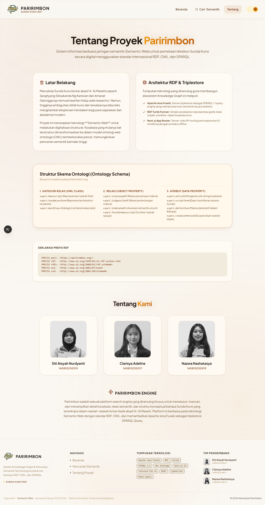
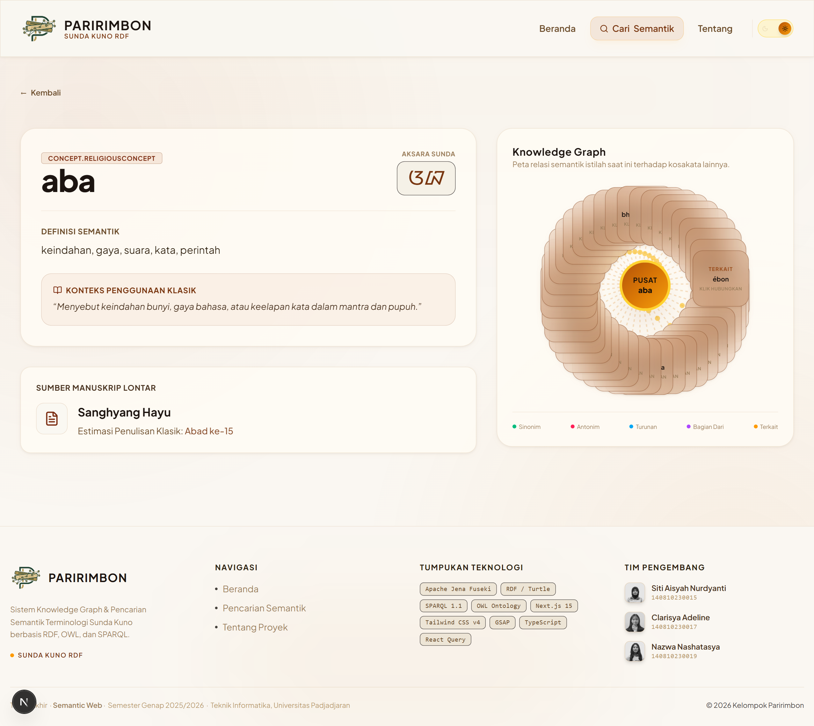

# Paririmbon - Terminologi Sunda Kuno (Knowledge Graph & Semantic Search)

Paririmbon adalah aplikasi penelusuran digital dan pencarian semantik (**semantic search**) interaktif untuk menjelajahi terminologi Sunda Kuno dari 11 naskah klasik (manuskrip) abad 14–16 Masehi. 

Aplikasi ini mengintegrasikan **Knowledge Graph** berbasis standar semantik internasional **RDF/OWL** dengan triplestore **Apache Jena Fuseki** sebagai mesin kueri **SPARQL 1.1**, dan disajikan dengan antarmuka web modern yang tangguh menggunakan **Next.js 15**, **Tailwind CSS v4**, **GSAP Animations**, dan **TanStack Query (React Query)**.

---

## 👥 Tim Pengembang (Kelompok Tugas Akhir Semantik Web)

| No | Foto Profil | Nama Anggota | NIM | Peran Utama |
|----|-------------|--------------|-----|-------------|
| 1 |  | **Siti Aisyah Nurdyanti** | `140810230015` | Ontologist & Backend Developer |
| 2 |  | **Clarisya Adeline** | `140810230017` | Frontend Architect & UI/UX Designer |
| 3 |  | **Nazwa Nashatasya** | `140810230019` | SPARQL Integrator & Data Engineer |

---

## 🚀 Fitur Utama Paririmbon

- **Halaman Beranda Dinamis**: Menampilkan statistik dataset (1.411 kosakata, 11 manuskrip, ~18.630 triple RDF) dengan statistik ringkas dan kartu naskah klasik interaktif yang langsung terhubung ke daftarnya.
- **Pencarian Semantik & Realtime**: Cari kosakata berdasarkan istilah latin, transliterasi aksara Sunda Kuno, definisi, atau naskah secara realtime dengan penyorotan teks (*text-highlighting*).
- **Auto Load dengan TanStack Query**: Integrasi *caching* & sinkronisasi data mutakhir menggunakan React Query untuk navigasi secepat kilat tanpa pemuatan ulang (*no full-page reload*).
- **Visualisasi Interaktif Graf (Knowledge Graph)**: Menampilkan keterhubungan visual antar entri kosakata (seperti sinonim, antonim, turunan, relasi semantik) menggunakan graf relasi interaktif.
- **Dukungan Light/Dark Mode Premium**: Desain premium bertema *Dark-Gold* bernuansa mewah yang dapat dialihkan secara instan ke *Light Mode* bernuansa kertas kuno dengan palet warna cokelat tua yang ramah di mata.
- **Navigasi Mulus & Progress Bar**: Animasi transisi halaman halus menggunakan GSAP terintegrasi dengan progress bar amber instan (<16ms) untuk memberikan respon klik seketika kepada pengguna.

---

## 📸 Tangkapan Layar Antarmuka (Screenshots)

Berikut adalah beberapa tampilan antarmuka dari aplikasi **Paririmbon**:

### 1. Beranda (ParHome)
Halaman depan premium yang memuat deskripsi proyek, statistik dataset semantik secara dinamis, dan kartu navigasi naskah klasik Sunda Kuno yang responsif.


### 2. Pencarian Semantik (ParSearch)
Halaman pencarian bertenaga SPARQL dengan kemampuan penyorotan teks (*highlight*), pencarian kosakata Sunda Kuno secara realtime, dan filter kategoris kelas kata.


### 3. Halaman Tentang Proyek (ParAbout)
Halaman informasi lengkap mengenai proyek semantik Paririmbon, arsitektur RDF, skema ontologi (OWL Class, Object Property, Data Property), serta biodata tim pengembang.


### 4. Halaman Detail & Knowledge Graph (ParDetail)
Halaman detail kosakata dan peta relasi semantik (*Knowledge Graph*) Sunda Kuno yang dinamis. Halaman ini dilengkapi dengan penulisan aksara Sunda asli, definisi semantik, konteks penggunaan klasik, manuskrip asal, serta visualisasi jalinan semantik interaktif (*Knowledge Graph*) yang memvisualisasikan relasi antarkata (seperti sinonim, antonim, turunan, bagian dari, dsb).


---

## 📂 Struktur Folder Proyek

```text
Archive/Paririmbon/app/
├── public/                       # Aset Statis & Media
│   ├── Awa.jpg                   # Foto Profil Nazwa
│   ├── Cla.jpg                   # Foto Profil Clarisya
│   ├── Ica.jpg                   # Foto Profil Siti Aisyah
│   ├── ParHome.png               # Tangkapan Layar Beranda
│   ├── ParSearch.png             # Tangkapan Layar Pencarian Semantik
│   ├── ParAbout.png              # Tangkapan Layar Tentang Proyek
│   ├── ParDetail.png             # Tangkapan Layar Detail & Graf Kosakata
│   ├── Paririmbon1.svg           # Logo Vektor Utama Paririmbon (Besar & Transparan)
│   └── favicon.ico               # Ikon Web Favorit
├── src/
│   ├── app/                      # Direktori Next.js App Router
│   │   ├── api/                  # API Endpoint Internal
│   │   │   ├── graph/[id]/       # Kueri relasi graf kosakata via SPARQL
│   │   │   ├── naskah/           # Kueri statistik naskah klasik
│   │   │   ├── search/           # Kueri mesin pencari kata kunci & filter kelas kata
│   │   │   └── term/[id]/        # Kueri data detail spesifik kosakata
│   │   ├── about/                # Halaman "Tentang Proyek"
│   │   │   └── page.tsx
│   │   ├── search/               # Halaman utama pencarian semantik
│   │   │   └── page.tsx
│   │   ├── term/[id]/            # Halaman detail kosakata beserta visualisasi graf relasi
│   │   │   └── page.tsx
│   │   ├── components/           # Komponen React Reusable
│   │   │   ├── Navbar.tsx        # Navigasi atas yang responsif dengan logo Paririmbon1.svg
│   │   │   ├── NavigationProgress.tsx # Slim amber top progress bar untuk loading antar page
│   │   │   ├── ThemeToggle.tsx   # Tombol toggle dark/light mode premium
│   │   │   └── WordGraph.tsx     # Komponen render graf relasi interaktif
│   │   ├── globals.css           # Desain sistem CSS dengan variabel tema HSL
│   │   ├── layout.tsx            # Struktur utama HTML dengan Footer premium 4 kolom
│   │   ├── loading.tsx           # Skeleton loading global
│   │   ├── page.tsx              # Halaman Beranda utama
│   │   └── providers.tsx         # Konfigurasi penyedia QueryClient (React Query)
│   └── lib/
│       └── sparqlClient.ts       # Klien kueri SPARQL (fetch HTTP ke endpoint Fuseki)
├── .env.local                    # Konfigurasi URL Endpoint Fuseki lokal
├── package.json                  # Manajemen dependensi Node.js
├── tsconfig.json                 # Konfigurasi TypeScript compiler
└── README.md                     # Panduan pengembang dasar
```

---

## 🛠️ Cara Menjalankan Aplikasi secara Lengkap

Ikuti langkah-langkah berikut secara berurutan untuk menjalankan keseluruhan ekosistem Paririmbon di komputer lokal Anda:

### 1. Prasyarat Sistem
Pastikan Anda sudah menginstal:
- **Node.js** (Rekomendasi versi v18 atau yang lebih baru)
- **Java JDK** (Rekomendasi versi 11 atau v17 ke atas, diperlukan oleh Apache Jena Fuseki)
- **Apache Jena Fuseki** (Telah terunduh dan diekstrak)

---

### 2. Jalankan Apache Jena Fuseki (Triplestore)
1. Buka folder instalasi Apache Jena Fuseki Anda di terminal.
2. Jalankan server Fuseki dengan perintah berikut:
   ```bash
   # Di Linux / macOS
   ./fuseki-server
   
   # Di Windows (CMD/PowerShell)
   fuseki-server.bat
   ```
3. Pastikan server Fuseki berjalan sukses. Secara default, Fuseki akan berjalan di port `3030`.
4. Buka browser Anda dan akses: **[http://localhost:3030](http://localhost:3030)**

---

### 3. Buat Dataset dan Unggah File RDF (`paririmbon_dataset.ttl`)
1. Di dasbor Fuseki, klik menu **"Manage datasets"** di bagian atas.
2. Klik tombol **"Add new dataset"**.
3. Isi kolom nama dataset dengan: `paririmbon`
4. Pilih tipe dataset: **Persistent (TDB2)** (agar data tetap tersimpan setelah server dimatikan), lalu klik **"Create dataset"**.
5. Setelah dataset berhasil dibuat, masuk ke tab **"Upload data"**.
6. Klik **"Select files"** dan pilih berkas dataset RDF kita yang terletak di:
   `d:\Kuliah\semester6\semweb\TugasAkhir\Archive\Paririmbon\paririmbon_dataset.ttl`
7. Klik tombol **"Upload all"** untuk memasukkan data ke triplestore.
8. Verifikasi pengunggahan dengan masuk ke menu **"Query"**, pilih dataset `/paririmbon`, lalu jalankan kueri default (`SELECT * WHERE { ?s ?p ?o } LIMIT 10`). Pastikan baris data RDF berhasil dikembalikan.

---

### 4. Jalankan Aplikasi Web Next.js
1. Buka terminal baru dan masuk ke direktori aplikasi Paririmbon:
   ```bash
   cd d:\Kuliah\semester6\semweb\TugasAkhir\Archive\Paririmbon\app
   ```
2. Pastikan file konfigurasi `.env.local` telah berisi endpoint kueri Fuseki Anda:
   ```env
   FUSEKI_URL=http://localhost:3030/paririmbon/query
   ```
3. Pasang semua dependensi proyek menggunakan npm:
   ```bash
   npm install
   ```
4. Jalankan server pengembangan lokal:
   ```bash
   npm run dev
   ```
5. Aplikasi web akan aktif dan siap diakses di alamat:
   **[http://localhost:3000](http://localhost:3000)**

---

## 🧱 Teknologi yang Digunakan

- **Next.js 15 (App Router)**: Framework React tingkat lanjut untuk performa tinggi, perutean dinamis, dan rendering sisi server.
- **Apache Jena Fuseki**: Server triplestore sebagai SPARQL 1.1 query engine untuk memproses graf data secara realtime.
- **RDF / OWL Ontology**: Struktur semantik kamus terinterkoneksi penuh untuk mereduksi ambiguitas penafsiran sejarah.
- **TanStack Query v5**: Library handal untuk manajemen *state* asinkronus, caching pintar, dan auto load data kueri.
- **Tailwind CSS v4 & GSAP**: Kombinasi kerangka visual responsif premium beserta transisi animasi mikro yang interaktif.
- **TypeScript**: Menjamin keandalan kode bebas bug melalui validasi tipe yang ketat.

---

## 🤝 Kontribusi & Hak Cipta
Aplikasi ini dibangun untuk memenuhi Tugas Akhir Matakuliah **Semantic Web (Semantik Web)**, Semester Genap 2025/2026, Program Studi Teknik Informatika, Universitas Padjadjaran.

*Kelompok Tugas Akhir Semantik Web © 2026. Semua Hak Dilindungi.*
